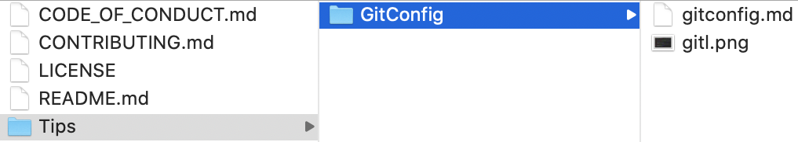

# CONTRIBUTING

Before submitting a tip, please review the [Code of Conduct](CODE_OF_CONDUCT.md).

**Some tips about submitting a tip**

- Add your tip the highest level category. For example, a tip about creating an extension on `DateFormatter` would go it **Swift**, even if you only include a screenshot demonstrating usage in an iOS app.
- Add your tip to the bottom of the list.
- Not all submitted tips will be included.
- Tips may be edited before being published.
- [Create an issue](https://github.com/scotteg/SwiftDevTips/issues) or submit a separate pull request to suggest an edit to an existing tip.

---

## What constitutes a tip?

A tip is a specific helpful suggestion. If it is non-specific or feels like it is promoting a person or product or sharing a rumor — it is probably not a tip.

**Examples**

✅ `Double-click on a curly brace to highlight the enclosed content.`

🚫 `[This awesome app](http://example.com) will let you create iOS apps with no code.`

🚫 `Inspired by [Sabre's Pyramid](https://theoffice.fandom.com/wiki/Pyramid), Apple is working on a triangular-shaped iPad.`

---

## Contributing your tip is easy.

1. **[Fork this repo](https://help.github.com/en/github/getting-started-with-github/fork-a-repo)**
2. **[Add your tip](CONTRIBUTING.md)**
3. **[Submit a pull request](https://help.github.com/en/github/collaborating-with-issues-and-pull-requests/creating-a-pull-request)**

---

## Format

There are two kinds of tips you may be interested to submit:

- A tip that refers to an external source, such as a blog post, tweet, etc.
- A new tip that you would like to add directly to this repo.

### Choose one of the following formats based on the type of tip you are submitting:

#### Refer to external source

- Choose this format to share an article, blog post, tweet, etc.
- Link specifically to the original tip whenever possible.
<br>*Example:*<br>
`[Easily find balancing braces and hide/show code](https://twitter.com/scotteg/status/1255916101638201344?s=20)`

#### Add new tip content
- **The entire tip—including attribution and links—is 140 characters or less**
    - Add the tip inline. 
    <br>*Examples:*
        - [Easily find balancing braces and hide/show code](https://twitter.com/scotteg/status/1255916101638201344?s=20)
        - Double-click on a curly brace to highlight the enclosed content.
- **The tip is greater than 140 characters**
    - Create a new Markdown file in `/Tips`.
    - Create a parent folder if your tip will include additional assets.
    <br>*Example:*

    - Write your tip in a succinct and easy to read format. Feel free to use pictures or videos, however, please optimize visual content for quick loading and optimal viewing. In most cases, this will be downsizing content to a max width of 2400 pixels. For example, a full-size screenshot of your Xcode window on a 15" MacBook Pro in default resolution is currently 3360 x 2100. This should be downsized to 2400 x 1500.
    - Feel free to include one link to your preferred online identity, social media, portfolio, etc. 
    <br>*Example:*

        In `README.md` under **Xcode**:<br>
        `[How to easily find balancing braces](/Tips/FindBalancingBraces.md)`
        
        In **/Tips/FindBalancingBraces.md**:
        
        ```
        Enable the code-folding ribbon to easily find balanced braces and hide/show code. You can also double-click on a folded code ellipsis marker (⋯) to unfold it.
        
        
        Submited by [@scotteg](https://twitter.com/scotteg).
        ```
