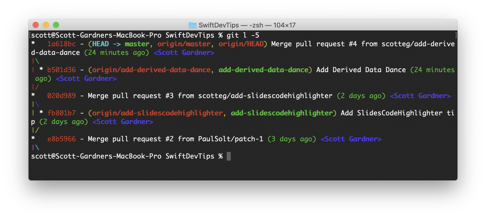

# Create Git Aliases to speed up working with Git in the CLI

1. Open **Terminal.app**.
2. `cd ~/` to switch to your home directory.
3. `open .gitconfig` to open your `.gitconfig` file in your default text editor.
4. Add this text:
```
[alias]
    b = branch
    co = checkout
    l = log --graph --all --decorate --pretty=format:'%Cred%h%Creset -%C(auto)%d%Creset %s %Cgreen(%cr) %C(bold blue)<%an>%Creset' --abbrev-commit --date=relative
	#logg = log --abbrev-commit --all --decorate --graph --oneline
    s = status
    showw = show --pretty --name-only
    statuss = status -u
```

Now you can use these aliases to reduce the number of keystrokes to do some of the most common actions in Git. And you'll also get nicely formatted, syntax-highlighted log graphs.

For example:

`git l -5` will print a formatted log of the last five commits.



Check out [this post](https://haacked.com/archive/2014/07/28/github-flow-aliases/) for additional alias ideas.

Submitted by [@scotteg](https://twitter.com/scotteg).